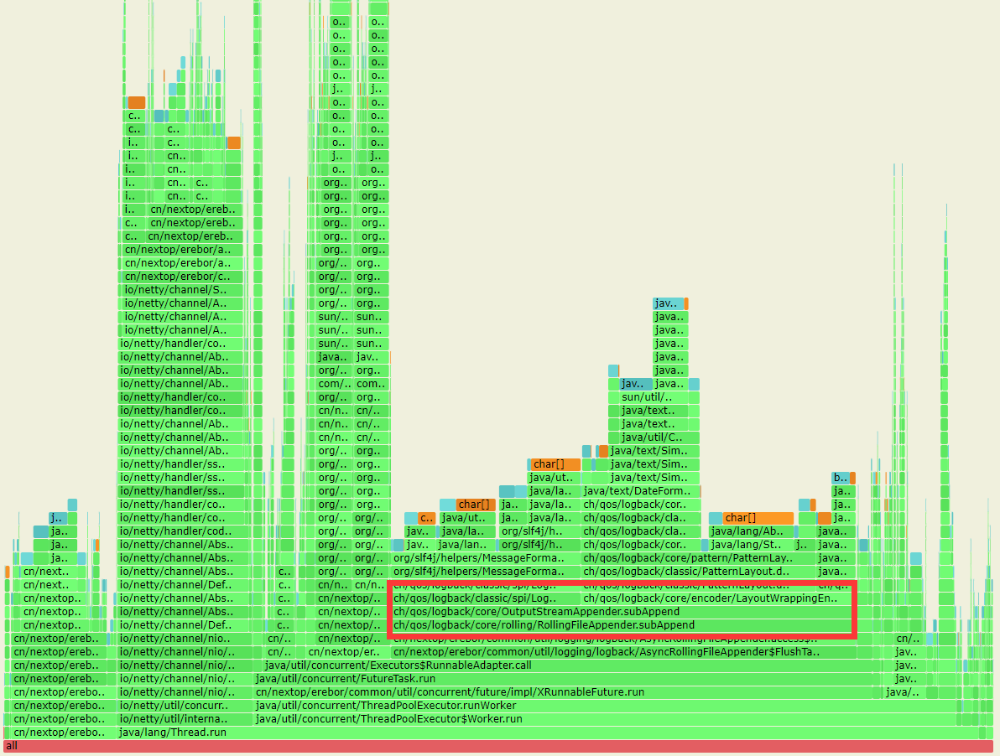
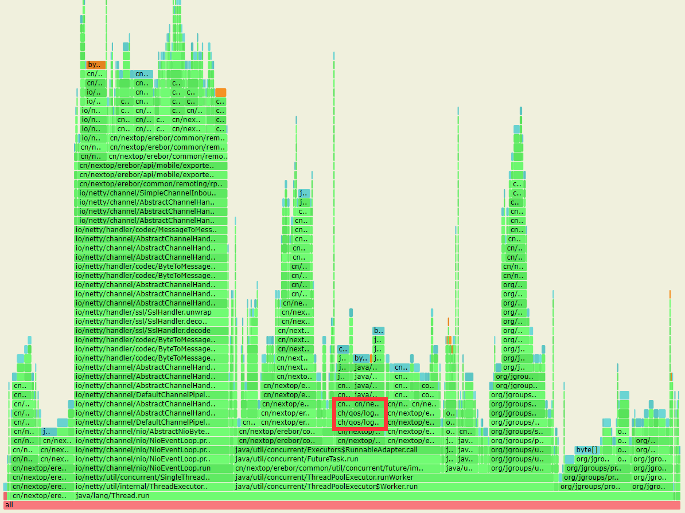

# Message-formatter

## 问题起源与描述

当使用`logback`做为`slf4j-api`的实现端打印日志时，我们通过[async-profiler](https://github.com/jvm-profiling-tools/async-profiler) 发现`logback`做类似  
`logger.info("{} {}", value1, value2)`这样的log解析时的内存分配以及性能存在瓶颈.
具体的解析代码见[MessageFormatter.arrayFormat](https://github.com/qos-ch/slf4j/blob/master/slf4j-api/src/main/java/org/slf4j/helpers/MessageFormatter.java#L179). 我们要实现一个高效的O(n)复杂度的 [format](https://github.com/moilioncircle/message-formatter/blob/master/src/main/java/com/moilioncircle/message/formatter/MessageFormatter.java#L25) 方法替换`MessageFormatter.arrayFormat`.  
需要实现的方法定义如下

```
public @Nullable String format(@Nullable String str, @Nullable Object[] args)
```

## 具体的答题要求

1. 当`str`为`null`时, 返回`null`. `format(null, new Object[]{"a"})`返回`null`
2. 当`args`为`null`或者`args.length < pattern length`时. `format("{} {} {a}", null)`返回`{null} {null} {a}`
3. 当`str`不存在`{}`等pattern时，直接返回str. `format("abc", new Object[]{"a"})`返回`abc`
4. 可能存在嵌套括号. `format("{{}}", new Object[]{"a"})`返回`{a}`
5. 使用`\`进行`{`, `}`的转义. `format("\\{\\}", new Object[]{"a"})`返回`{}`
6. 使用`\`转义`\`自身. `format("\\\\", new Object[]{"a"})`返回`\`
7. 可能仅存在`{`或者`}`. `format("{c", new Object[]{"a"})`返回`{c`


更多测试用例参见[MessageFormatterTest](https://github.com/moilioncircle/message-formatter/blob/master/src/test/java/com/moilioncircle/message/formatter/MessageFormatterTest.java)

## 示例

```java  

format(null, new Object[]{"a"}) return null
format("{} {} {a}", null) return "{null} {null} {a}"
format("{} {} {a}", new Object[]{"b"}) return "{b} {null} {a}"
format("{} {} {a}", new Object[]{"b", "c", "d"}) return "{b} {c} {a}"
format("abc", new Object[]{"a"}) return "abc"
format("{{}}", new Object[]{"a"}) return "{a}"
format("\\{\\}", new Object[]{"a"}) return "{}"
format("\\{}", new Object[]{"a"}) return "{}"
format("\\\\", new Object[]{"a"}) return "\"
format("{c", new Object[]{"a"}) return "{c"

```
## 答题建议

* clone或fork成自己的repository
* 实现src/main/java/com/moilioncircle/message/formatter/MessageFormatter中的format方法
* 通过src/test/java/com/moilioncircle/message/formatter/MessageFormatterTest进行测试
* 如果clone到本地，可以使用 mvn clean package 进行测试
* 如果fork到github，可以Pull Request，进行测试

## 优化之后的内存分配对比图

* 优化之前



* 优化之后

